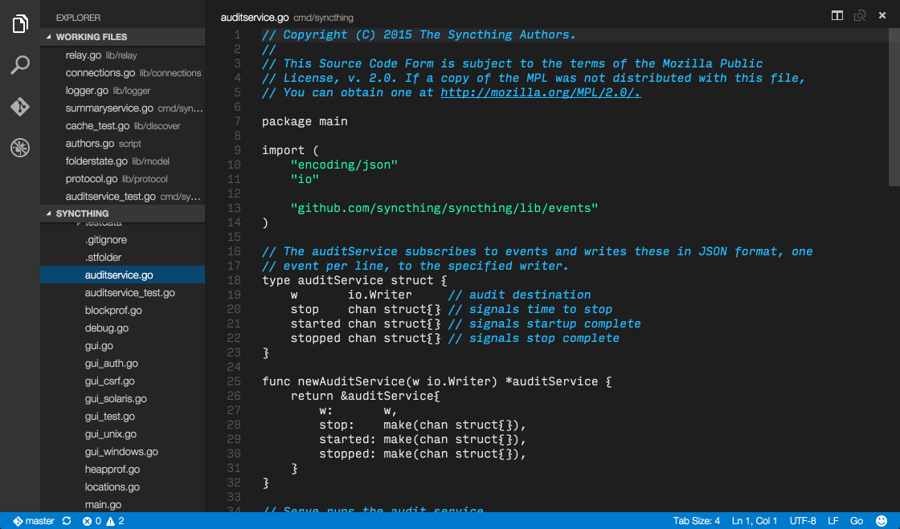

Almost Mono
===========

This is an almost monochrome theme for VS Code (and compatibles like Sublime
Text and Textmate).

Normal code and text is in light grey, comments are highlighed in blue
italics, strings are in green with escape sequences bolded.

